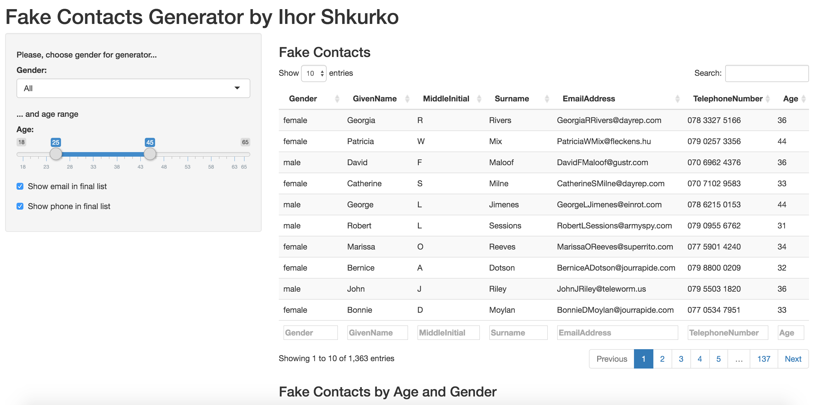

Fake Contacts Generator presentation
========================================================
author: Ihor Shkurko
date: 2016-04-0

Introduction
========================================================

This is presentation for Fake Contacts Generator, that is part of Course Project for Developing Data Products.

**Agenda**
- Idea
- Data Details
- Data Example
- Summary

Idea
========================================================

<div style="color: #25679E;">
The main idea of the application is to provide usefule interface for fake contact data. It could be use for testing different application where requires relevant contact information like name, email, phone.
</div>



Data Details
========================================================

**Data structure**
- **Gender** - male or female
- **GivenName**	- first name
- **MiddleInitial** - first letter of middle name
- **Surname**	- last name 
- **EmailAddress** - email address
- **TelephoneNumber**	- phone number
- **Age** - person age

Interface provides possbilbity to change Gender and Age range for output result.

Data Example
========================================================


```
  Gender GivenName MiddleInitial Surname               EmailAddress
1   male    Angelo             D    Hunt    AngeloDHunt@armyspy.com
2 female   Georgia             R  Rivers  GeorgiaRRivers@dayrep.com
3 female    Andrea             T  Dortch   AndreaTDortch@dayrep.com
4 female     Kelly             W   Lyman     KellyWLyman@einrot.com
5 female   Frances             M  Alcorn  FrancesMAlcorn@dayrep.com
6   male   Octavio             R  Porter OctavioRPorter@armyspy.com
```

Summary
========================================================

Fake Contacts Generator could be find by link: https://ishkurko.shinyapps.io/shiny-application/

All source code Course Project locates on the GitHub repo: https://github.com/ishkurko/shiny-application-and-reproducible-pitch

